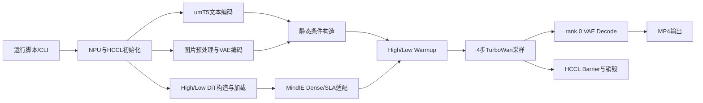
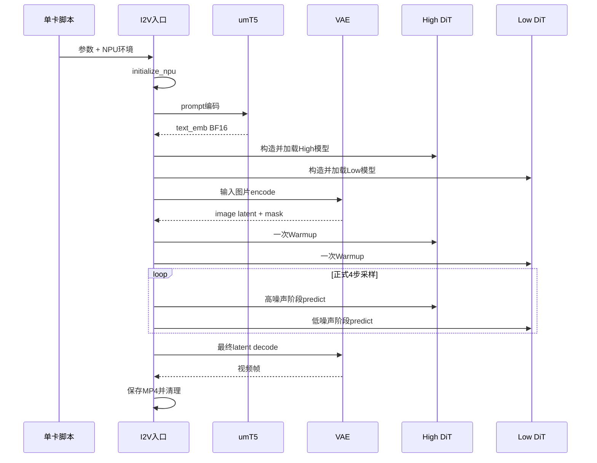
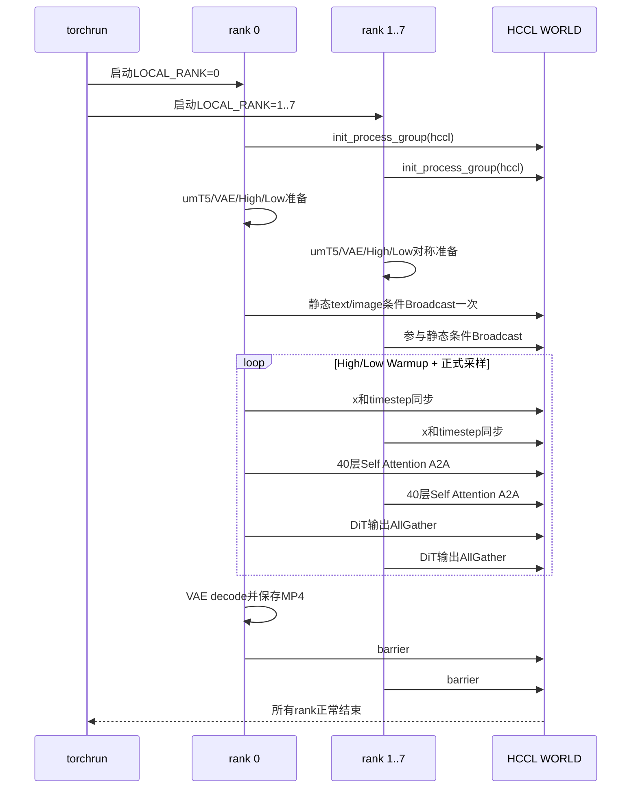
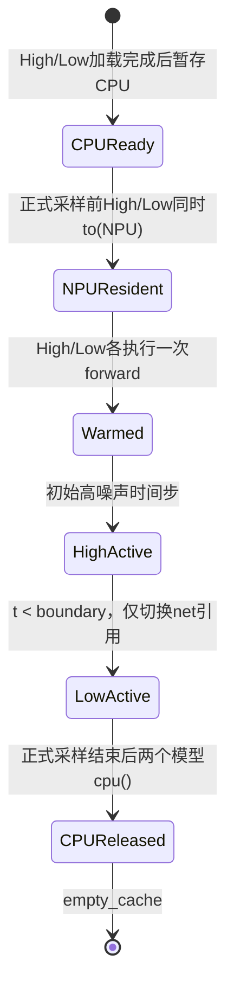
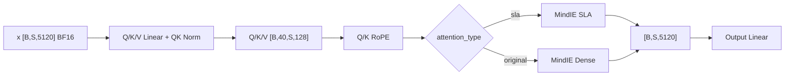
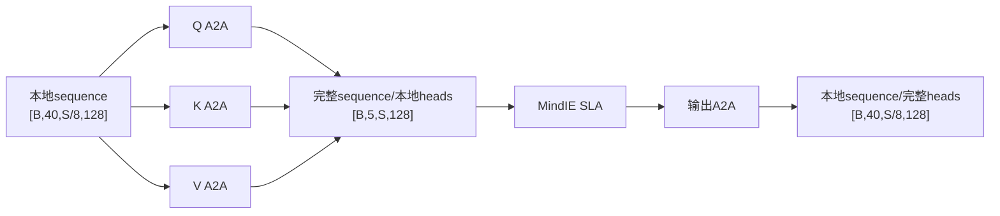
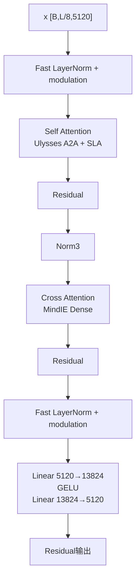
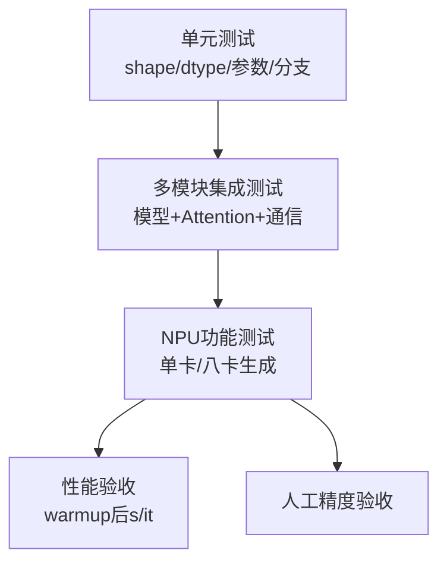

# TurboWan2.2 I2V Ascend 950 功能设计说明书

## 文档信息

| 项目 | 内容 |
| --- | --- |
| 文档名称 | TurboWan2.2 I2V Ascend 950 功能设计说明书 |
| 文档版本 | V1.0 |
| 编写日期 | 2026-09-15 |
| 代码基线 | `TurboDiffusion-official` `main`，基线提交 `cd0bd03` |
| 关联需求 | 《TurboWan2.2 I2V Ascend 950 适配需求分析报告》 |
| 目标模型 | TurboWan2.2-I2V-A14B-720P |
| 目标硬件 | Ascend 950 系列 NPU |
| 文档状态 | 待评审 |

## 1. 设计目的和边界

本文档说明 TurboWan2.2 I2V 在 Ascend 950 上的功能结构、主数据流、模块职责、Attention 接入、多卡 Ulysses 通信、模型生命周期、错误处理和测试设计。

设计边界如下：

- 入口：`wan2.2_i2v_infer.py` 接收命令行参数；
- 输入：图片、prompt、High/Low DiT、umT5 和 VAE 权重；
- 输出：rank 0 保存 MP4；
- 运行模式：单卡或单机八卡 Ulysses；
- 精度：BF16 非量化；
- Attention：MindIE SLA Self Attention 或 MindIE Dense Self Attention；
- 停止点：视频保存和多卡进程组销毁。

本文不设计 TP、量化、多机、训练和服务化并发。

## 2. 设计原则

1. **主流程可读**：保留单一 Wan2.2 I2V 推理入口，设备、条件、模型和采样顺序在主流程中可追踪；
2. **算子契约明确**：Attention 边界明确 BNSD、dtype、shape 和后端；
3. **单卡和多卡共享语义**：多卡只改变 sequence/head 的数据归属，不改变采样算法；
4. **对称执行优先**：多 rank 在 NPU 初始化、umT5 和 DiT 前向阶段保持相同执行阶段；
5. **静态数据只同步一次**：prompt embedding 和图像条件不在每次 DiT forward 重复 Broadcast；
6. **模型切换不搬运**：High/Low 同时驻留，切换只改变当前模型引用；
7. **Warmup 不污染计时**：High/Low Warmup 位于正式 tqdm 之前；
8. **诊断与产品接口分离**：系统 Profiler 用于性能分析，不增加临时同步计时 CLI。

## 3. 总体架构



### 3.1 组件职责

| 组件 | 文件 | 职责 |
| --- | --- | --- |
| 单卡运行脚本 | `scripts/inference_wan2.2_i2v_npu_single.sh` | 校验文件、设置环境、选择物理 NPU、启动 Python |
| 八卡运行脚本 | `scripts/inference_wan2.2_i2v_npu_8card.sh` | 设置 8 卡环境并通过 torchrun 启动 8 个 rank |
| I2V 推理入口 | `turbodiffusion/inference/wan2.2_i2v_infer.py` | 串联设备、文本、图片、模型、Warmup、采样、保存和清理 |
| 模型工厂 | `turbodiffusion/inference/modify_model.py` | 构造 WanModel、替换 SLA、兼容 Dense checkpoint、加载权重 |
| Wan2.2 DiT | `turbodiffusion/rcm/networks/wan2pt2.py` | Patch/Text/Time embedding、40层Block、BNSD Attention、CP切分与Gather |
| Ulysses通信 | `turbodiffusion/rcm/utils/a2a_cp.py` | BNSD All-to-All、序列分片与Head分片互换 |
| 条件同步 | `turbodiffusion/rcm/utils/context_parallel.py` | Broadcast、sequence split、输出 AllGather |
| umT5 | `turbodiffusion/rcm/utils/umt5.py` | tokenizer、文本编码器加载与embedding计算 |
| VAE | `turbodiffusion/rcm/tokenizers/wan2pt1.py` | 首帧encode和视频decode |
| MindIE-SD | 外部依赖 | Dense Attention、SparseLinearAttention、Fast LayerNorm |

## 4. 关键配置契约

### 4.1 固定模型结构

`Wan2.2-A14B` 的当前固定结构：

| 参数 | 值 | 类型 |
| --- | ---: | --- |
| Hidden dim | 5120 | 代码固定值 |
| FFN dim | 13824 | 代码固定值 |
| Attention heads | 40 | 代码固定值 |
| Head dim | 128 | `5120 / 40` |
| Transformer blocks | 40 | 代码固定值 |
| Text length | 512 | 代码固定值 |
| Input channels | 36 | I2V 模型固定值 |
| Output channels | 16 | latent通道固定值 |

### 4.2 标准验收配置

| 参数 | 值 |
| --- | --- |
| `model` | `Wan2.2-A14B` |
| `resolution` | `720p` |
| `aspect_ratio` | `16:9` |
| `adaptive_resolution` | 开启 |
| `num_frames` | 81 |
| `num_steps` | 4 |
| `num_samples` | 1 |
| `attention_type` | `sla` |
| `sla_topk` | 0.1 |
| `ode` | 开启 |
| dtype | BF16 |
| quantization | 关闭 |
| `FAST_LAYERNORM` | 1 |

### 4.3 设备选择

单卡：

```text
ASCEND_RT_VISIBLE_DEVICES=<physical id>
    ↓
进程内逻辑设备 npu:0
    ↓
--device_id 0
```

八卡：

```text
torchrun --nproc_per_node=8
    ↓
LOCAL_RANK 0..7
    ↓
npu:0..npu:7
    ↓
HCCL WORLD，ulysses_size=8
```

八卡入口校验：

```text
ulysses_size > 0
ulysses_size == WORLD_SIZE
0 <= RANK < WORLD_SIZE
0 <= LOCAL_RANK < WORLD_SIZE
```

## 5. 主流程设计

### 5.1 单卡主流程



### 5.2 八卡主流程



## 6. 模型加载设计

### 6.1 构造顺序

```text
with torch.device("meta")
    ↓
创建 WanModel2pt2 结构，不立即分配完整参数存储
    ↓
读取 checkpoint state_dict
    ↓
根据 attention_type 配置 Attention backend
    ↓
加载 state_dict(assign=True)
    ↓
移动至当前 NPU，切换 eval
```

High/Low 模型使用相同结构，不同 checkpoint。

### 6.2 SLA checkpoint

SLA checkpoint 包含每层 Self Attention 的额外参数：

```text
self_attn.attn_op.local_attn.proj_l.weight
self_attn.attn_op.local_attn.proj_l.bias
```

`attention_type=sla` 时，模型先创建 MindIE `SparseLinearAttention`，使 `proj_l` 参数有对应模块，然后严格加载全部权重。

### 6.3 Dense checkpoint兼容

`attention_type=original` 时，Dense Attention 不包含 `proj_l`。加载器仅过滤上述两个 SLA 专属 suffix，再使用 `strict=True` 加载。

该策略满足：

```text
允许：SLA checkpoint → Dense运行时，多出的proj_l被精确忽略
拒绝：其他未知权重、缺失公共权重或结构不匹配
```

### 6.4 模型生命周期



High/Low 同时驻留避免了采样中间约数秒的模型搬运开销。当前测试数据表明两模型同时驻留时每卡显存仍有余量，因此该行为固定为正式流程，不设计开关。

## 7. 文本和图像条件设计

### 7.1 umT5

文本编码流程：

```text
text_encoder_path父目录
    ↓
定位 google/umt5-xxl tokenizer
    ↓
加载 models_t5_umt5-xxl-enc-bf16.pth
    ↓
prompt tokenize + umT5 forward
    ↓
text_emb.to(current NPU, BF16)
    ↓
synchronize + clear_umt5_memory
```

八卡采用所有 rank 对称执行：每个 rank 在自己的 NPU 上计算相同 prompt embedding，并关闭模型状态同步。该设计增加启动阶段资源消耗，但避免某个 rank 独占 NPU kernel、其他 rank 进入 HCCL 等待时出现不对称死锁或超时。

### 7.2 图像条件

```text
输入图片
  ↓ RGB
按目标面积和输入宽高比计算H/W
  ↓ Resize + Normalize[-1,1]
首帧 + 后续全零帧
  ↓ VAE encode
encoded_latents
  + 首帧mask
  ↓ channel拼接
y_B_C_T_H_W
```

### 7.3 Ulysses分辨率对齐

DiT token 数：

```text
L = latent_frames × token_height × token_width
```

必须满足：

```text
L % ulysses_size == 0
```

若不满足，分别计算：

- 向上对齐 token height 的候选分辨率；
- 向上对齐 token width 的候选分辨率。

选择面积增长更小的候选，使 Ulysses 可切分且尽量减少对目标分辨率的影响。

### 7.4 静态条件同步

`crossattn_emb` 和 `y_B_C_T_H_W` 在四个正式采样步内不变化，因此在采样开始前 Broadcast 一次，并携带：

```python
static_condition_is_synchronized = True
```

进入每个 DiT forward 后：

- 仍同步动态 `x` 和 `timestep`；
- 不再重复同步 text 和 image condition。

该设计已在实际八卡测试中确认有性能收益。

## 8. Attention设计

### 8.1 后端选择

| `attention_type` | Self Attention | Cross Attention |
| --- | --- | --- |
| `sla` | MindIE `SparseLinearAttention` | MindIE Dense Attention |
| `original` | MindIE Dense Attention | MindIE Dense Attention |

SLA 只替换 `type(module) is WanSelfAttention2pt2` 的模块，不替换 `WanCrossAttention`。

### 8.2 BNSD接口契约

模型固定参数：

```text
C = 5120
N = 40 heads
D = C / N = 128
```

Q/K/V投影后：

```text
[B, S, C]
  ↓ view
[B, S, N, D]
  ↓ transpose(1,2)
[B, N, S, D]  BNSD
```

MindIE Dense 和 SLA 均接收 BNSD。Attention 输出恢复为：

```text
[B, N, S, D]
  ↓ transpose + contiguous
[B, S, N, D]
  ↓ flatten heads
[B, S, C]
```

### 8.3 Self Attention单卡路径



### 8.4 Self Attention八卡Ulysses路径

在进入某层前，视频 sequence 已按 rank 切分：

```text
每rank输入Q/K/V： [B, 40, S/8, 128]
```

第一次 All-to-All 把“切 sequence”变为“切 heads”：

```text
[B, 40, S/8, 128]
        ↓ A2A scatter heads
[B, 5, S, 128]
```

每张卡拿到完整 sequence 和 5 个 heads，可以独立执行本地 SLA：

```text
[B, 5, S, 128]
        ↓ MindIE SLA
[B, 5, S, 128]
```

第二次 All-to-All 恢复 sequence shard：

```text
[B, 5, S, 128]
        ↓ A2A scatter sequence
[B, 40, S/8, 128]
```

完整路径：



当前实现的输入 Q、K、V 分别执行同步 All-to-All，输出再执行一次同步 All-to-All。

### 8.5 Cross Attention路径

Cross Attention 的 Query 来自本地视频 sequence shard，Key/Value 来自完整文本 context：

```text
Q: [B, 40, S/8, 128]
K: [B, 40, 512, 128]
V: [B, 40, 512, 128]
```

Cross Attention 不挂载 Ulysses process group，不执行 A2A，直接在每张卡本地使用 MindIE Dense Attention。这样每个本地视频 token 都能访问完整文本 token，同时避免复制文本 sequence 的错误通信。

## 9. Fast LayerNorm设计

进程启动时读取：

```bash
FAST_LAYERNORM=1
```

启用后，WanAttentionBlock 中的 `norm1`、`norm2` 和适用的 `norm3` 调用 MindIE `fast_layernorm`。未启用时使用模型原生 LayerNorm。

该开关必须在 Python import `wan2pt2.py` 前设置，因为模块加载阶段决定是否导入 MindIE Fast LayerNorm。

RMSNorm 的 dtype 契约为：内部可使用 FP32 计算平方均值，但结果必须转换回输入 dtype，保证后续 Q/K/V 一致为 BF16。

## 10. DiT多卡数据流

### 10.1 站点契约

| # | 站点 | 输入 | 操作 | 输出 |
| ---: | --- | --- | --- | --- |
| 1 | 动态同步 | 完整 `x`、timestep | HCCL Broadcast | 各rank相同动态输入 |
| 2 | 条件拼接 | `x` + 图像条件 `y` | channel concat | I2V 36通道输入 |
| 3 | Patchify | `[B,C,T,H,W]` | rearrange + contiguous | `[B,L,Din]` |
| 4 | Sequence split | `[B,L,Din]` | 按dim=1切分 | `[B,L/8,Din]` |
| 5 | Embedding | 本地token、时间、文本 | Linear/position生成 | Block输入和条件 |
| 6 | 40层Block | 本地sequence | Self Ulysses + Cross Dense + FFN | `[B,L/8,5120]` |
| 7 | Head | 本地sequence | Norm + Linear | 本地输出tokens |
| 8 | Output gather | 各rank本地tokens | HCCL AllGather | 每rank完整输出tokens |
| 9 | Unpatchify | `[B,L,out]` | rearrange | 完整latent视频 |

### 10.2 Block内部



## 11. 采样设计

### 11.1 时间步

程序根据：

```text
[atan(sigma_max), 1.5, 1.4, 1.0, 0]
```

截取与 `num_steps` 对应的中间时间步，再转换到 Rectified Flow 时间参数。

### 11.2 High/Low选择

```text
timestep >= boundary → High-noise model
timestep <  boundary → Low-noise model
```

默认 `boundary=0.9`。正式循环中首次跨过 boundary 时只执行：

```python
net = low_noise_model
```

不执行模型搬运。

### 11.3 Warmup

Warmup 遍历正式 schedule 中的时间步：

- 找到第一个 High 时间步，对 High 模型前向一次；
- 找到第一个 Low 时间步，对 Low 模型前向一次；
- 同一个模型只 Warmup 一次；
- 完成后执行一次 NPU synchronize；
- 然后才创建正式 `Sampling` 进度条。

### 11.4 ODE更新

每步模型输出速度预测 `v_pred`，ODE 更新为：

```text
x_next = x - (t_cur - t_next) × v_pred
```

采样状态 `x` 使用 FP64 维护更新语义，进入模型前转换为 BF16；NPU 不支持的 Double 算子由当前运行时按既有行为处理。该路径必须通过输出精度和 Profiler 继续评估是否存在多余转换。

## 12. 输出和资源清理

单卡：当前进程执行 VAE decode、视频拼接和 MP4 保存。

八卡：

```text
rank 0   → VAE decode → MP4保存
rank 1-7 → 不执行decode/save
全部rank → HCCL barrier → destroy_process_group
```

正式采样结束后：

1. High 模型移回 CPU；
2. Low 模型移回 CPU；
3. 清理 NPU cache；
4. rank 0 解码和保存；
5. 多卡进程同步退出。

## 13. 参数和环境变量设计

### 13.1 核心CLI

| 参数 | 作用 | 标准值 |
| --- | --- | --- |
| `--image_path` | 输入首帧 | 测试集图片 |
| `--prompt` | 文本提示词 | 固定验收prompt |
| `--high_noise_model_path` | High checkpoint | 非量化权重 |
| `--low_noise_model_path` | Low checkpoint | 非量化权重 |
| `--text_encoder_path` | umT5 checkpoint | BF16权重 |
| `--vae_path` | VAE checkpoint | Wan2.1 VAE |
| `--num_frames` | 视频帧数 | 81 |
| `--num_steps` | 采样步数 | 4 |
| `--attention_type` | `sla`或`original` | `sla` |
| `--sla_topk` | SLA保留比例 | 0.1 |
| `--ulysses-size` | Ulysses并行度 | 单卡1，八卡8 |
| `--device_id` | 单卡逻辑设备 | 0 |
| `--ode` | ODE采样 | 开启 |

不提供 `distributed-backend` 参数，backend 固定为 HCCL。不提供 `tensor-parallel-size`。已删除临时的 `profile-stages` 参数。

### 13.2 核心环境变量

| 环境变量 | 作用 |
| --- | --- |
| `ASCEND_RT_VISIBLE_DEVICES` | 选择可见物理NPU |
| `PYTHONPATH` | 指向仓库 `turbodiffusion` |
| `PYTORCH_NPU_ALLOC_CONF` | NPU内存分配策略 |
| `TASK_QUEUE_ENABLE` | 开启任务队列 |
| `CPU_AFFINITY_CONF` | CPU绑核配置 |
| `TOKENIZERS_PARALLELISM` | 关闭tokenizer线程告警/并行 |
| `FAST_LAYERNORM` | 启用MindIE Fast LayerNorm |

`PROFILE_ATTN_LAYERS` 是研发诊断环境变量，不属于正式推理接口和验收配置。

## 14. 异常处理设计

| 异常 | 检测位置 | 处理 |
| --- | --- | --- |
| 缺少torch_npu | NPU初始化 | 抛出明确RuntimeError |
| NPU不可用 | NPU初始化 | 终止并提示设备不可用 |
| torchrun元数据缺失 | 多卡绑定 | 提示必须使用torchrun |
| WORLD_SIZE不一致 | 多卡绑定 | 在HCCL计算前拒绝启动 |
| token数不可整除 | 分辨率处理/DiT | 先最小对齐；仍不合法则assert |
| MindIE-SD缺失 | Attention后端创建 | 抛出依赖错误 |
| Dense checkpoint存在SLA权重 | 模型加载 | 仅过滤proj_l后严格加载 |
| 其他checkpoint不匹配 | 模型加载 | strict加载失败并停止 |
| Q/K/V dtype或布局错误 | MindIE算子边界 | 算子报错；单测保护BNSD |
| 多卡rank未收敛 | HCCL collective | 根据rank日志和系统Profiler定位 |
| 输出目录不存在 | 运行脚本 | `mkdir -p` |

## 15. 测试设计

### 15.1 测试分层



### 15.2 自动化测试重点

1. CLI 只暴露 Ulysses 并行度，不暴露 TP/backend/profile-stage；
2. 单卡脚本不携带量化参数；
3. 八卡脚本使用 `nproc_per_node=8`、`ulysses-size=8`；
4. `attention_type=sla` 只替换 Self Attention；
5. Self/Cross Dense 接收 BNSD；
6. Ulysses A2A 正确交换 sequence/head 并恢复本地输出；
7. High/Low Warmup 各执行一次且位于正式采样前；
8. High/Low 在采样期间同时驻留；
9. text/image条件只在采样前同步一次；
10. Dense checkpoint 仅过滤 SLA `proj_l`；
11. HCCL 初始化、barrier和销毁顺序正确；
12. 仅rank 0 decode和保存。

### 15.3 NPU测试矩阵

| 用例 | 卡数 | Attention | 输出 | 性能要求 |
| --- | ---: | --- | --- | --- |
| TC-NPU-01 | 1 | SLA | 720P/81f MP4 | `<10.5 s/it` |
| TC-NPU-02 | 1 | Dense | 720P/81f MP4 | 功能对照，不设本期硬指标 |
| TC-NPU-03 | 8 | SLA/Ulysses | 720P/81f MP4 | `≤1.6 s/it` |
| TC-NPU-04 | 8 | SLA/Ulysses | 重复3次 | 无随机崩溃和torchrun异常 |

### 15.4 精度检查

固定以下变量：

- 输入图片；
- prompt；
- seed；
- High/Low checkpoint；
- 720P、81f、4steps；
- `sla_topk=0.1`。

对单卡、八卡输出进行并排检查，记录主体一致性、运动连续性、颜色、闪烁、条件遵循和异常帧。后续可引入 VBench 形成自动化指标。

## 16. 性能设计和分析方法

### 16.1 已实现优化

| 优化 | 设计作用 |
| --- | --- |
| MindIE SLA | 降低长视频Self Attention计算量 |
| BNSD直连 | 避免算子接口布局不匹配 |
| Fast LayerNorm | 使用MindIE高性能归一化 |
| High/Low同时驻留 | 消除正式采样中模型CPU/NPU切换 |
| High/Low固定Warmup | 排除首次算子编译和缓存建立影响 |
| 静态条件一次Broadcast | 去除每个DiT forward重复text/image同步 |
| Ulysses | 将长sequence的Self Attention分布到8张卡 |

### 16.2 当前性能事实

- 历史四卡结果约 `3.82 s/it`；
- 历史八卡基线约 `2.02 s/it`；
- 静态条件 Broadcast 优化已确认有收益，但最新精确值待补；
- 八卡目标为 `≤1.6 s/it`，尚未形成达标记录；
- 早期分层测量显示 Self Attention 中 A2A 通信占比较高，但手写同步计时已从正式 CLI 删除。

### 16.3 后续分析顺序

优先使用 `msprof` 或 `torch_npu.profiler`，分析：

1. `HcomBroadcast`、`HcomAllToAll`、`HcomAllGather` 的总耗时和暴露时间；
2. 8 个 rank 是否存在负载不均；
3. MatMul/Linear、SLA、Cross Attention、FFN、Norm、RoPE、Cast和layout转换占比；
4. Host下发空洞和不必要同步；
5. Warmup后四个正式步骤的稳定性。

Profiler 运行时的绝对 `s/it` 不用于验收。优化完成后必须关闭 Profiler，用正常进度条重新测量。

### 16.4 候选优化，不属于当前已实现能力

| 候选项 | 预期作用 | 风险/前置条件 |
| --- | --- | --- |
| 移除冗余动态Broadcast | 减少每步外围通信 | 必须先验证各rank `x` 完全一致 |
| 保持采样状态分片 | 减少每步输出AllGather和再次切分 | 改动较大，需重构采样状态契约 |
| 合并Q/K/V输入A2A | 减少collective启动次数 | 需验证pack/unpack和峰值显存 |
| A2A与SLA重叠 | 隐藏暴露通信 | 单独收益上限不足以保证达标 |
| 缓存RoPE/Text projection | 去除每步静态重复计算 | 需处理High/Low模型缓存归属 |
| 缓存Cross K/V | 减少每层文本投影 | 增加每模型缓存显存 |
| QKV/FFN/逐元素融合 | 降低MatMul调度和Vector开销 | 由Profiler确认热点后实施 |

候选项必须逐项完成“基线—单变量修改—功能/精度复核—性能复测”，不得同时叠加多个未经验证的改动。

## 17. 可观测性设计

正式日志至少包含：

- 当前rank和NPU绑定；
- HCCL初始化开始/结束；
- umT5开始/结束；
- DiT模型加载结果；
- 自适应/对齐后的分辨率；
- High/Low Warmup状态；
- High→Low切换；
- rank 0视频保存路径；
- HCCL正常结束。

临时问题定位优先级：

```text
系统Profiler
  > 有范围的环境变量诊断
  > 临时代码日志
  > 正式CLI参数
```

临时代码日志在问题解决后应删除，避免长期维护和性能干扰。

## 18. 已知限制

1. 当前目标只验证单机八卡，不保证多机；
2. `ulysses_size` 必须等于 `WORLD_SIZE`，不支持8卡资源上只让部分rank参与同一任务；
3. 所有 rank 对称加载 umT5，启动资源占用较高；
4. 当前每次 DiT forward 仍同步动态 `x/timestep`；
5. 当前每次 DiT forward 结束会 AllGather 完整输出；
6. Q/K/V 输入 A2A 仍为三次同步 collective；
7. 性能受 HCCL 拓扑和软件栈影响，验收环境必须固定；
8. 精度尚未形成 VBench 自动化报告；
9. 量化、TP、混合并行均不在本期设计中。

## 19. 实现文件映射

| 设计能力 | 实现文件 |
| --- | --- |
| 主推理Pipeline | `turbodiffusion/inference/wan2.2_i2v_infer.py` |
| 模型选择和Attention替换 | `turbodiffusion/inference/modify_model.py` |
| Wan2.2 Block和BNSD | `turbodiffusion/rcm/networks/wan2pt2.py` |
| BNSD Ulysses A2A | `turbodiffusion/rcm/utils/a2a_cp.py` |
| Broadcast/Split/Gather | `turbodiffusion/rcm/utils/context_parallel.py` |
| umT5设备和加载 | `turbodiffusion/rcm/utils/umt5.py` |
| VAE设备和编解码 | `turbodiffusion/rcm/tokenizers/wan2pt1.py` |
| 单卡运行 | `scripts/inference_wan2.2_i2v_npu_single.sh` |
| 八卡运行 | `scripts/inference_wan2.2_i2v_npu_8card.sh` |
| 自动化回归 | `tests/inference/test_wan22_*.py` |

## 20. 设计决策摘要

| 决策 | 结论 | 原因 |
| --- | --- | --- |
| 量化 | 不使用 | 本期明确要求非量化 |
| 多卡方式 | 纯Ulysses | 聚焦长视频sequence并行，不引入TP复杂度 |
| backend | 固定HCCL | 目标硬件固定为Ascend NPU |
| SLA布局 | BNSD | 对齐MindIE算子输入契约 |
| Cross Attention | Dense且不做A2A | Query已为本地sequence，文本K/V应保持完整 |
| High/Low切换 | 双模型常驻 | 显存允许，避免切换搬运进入正式耗时 |
| Warmup | 固定执行 | 验收需要稳定正式采样数据 |
| umT5多卡 | 所有rank对称执行 | 避免非对称NPU/HCCL阶段导致超时或卡死 |
| 静态条件 | 采样前Broadcast一次 | 四个采样步内内容不变 |
| 性能诊断 | 系统Profiler | 避免同步计时代码成为正式参数并扰动性能 |
